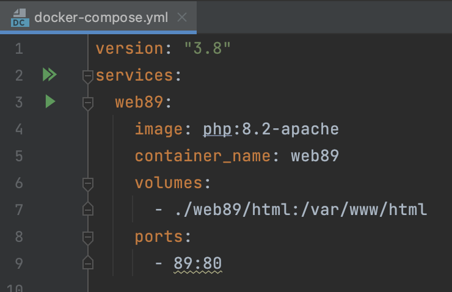
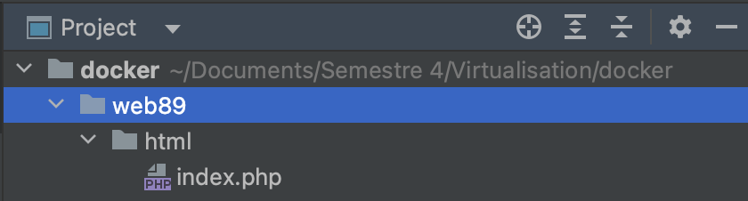
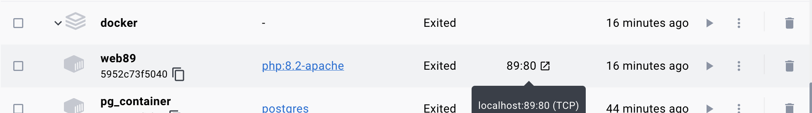
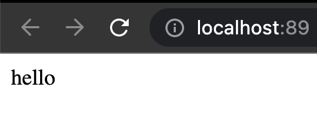
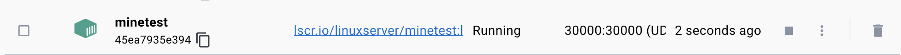
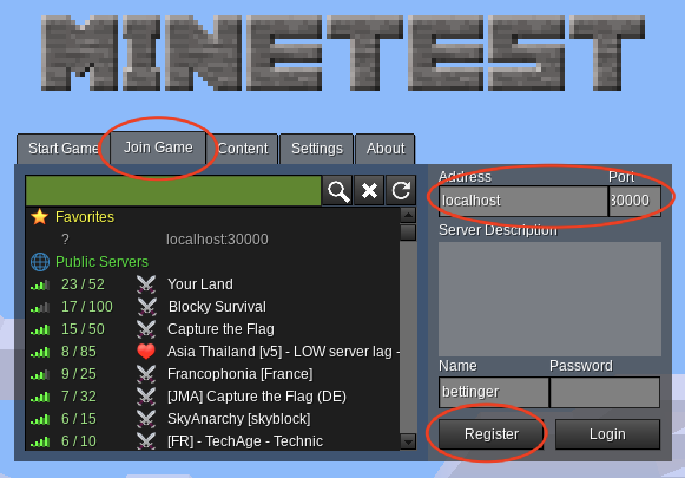

# TP-Docker-web89

## Installer un serveur web (apache + php8.2), un serveur de bdd mysql, phpmyadmin et minetest avec Docker

### Prérequis :
Docker doit être installer sur la machine => https://www.docker.com/

#### Pour installer ces serveurs, il faut récupérer le fichier *docker-compose.yml* le stocker dans un dossier de votre choix et éxécuter dans le terminal :   
```docker compose up -d //configuration des conteneurs et exécution en mode detached  ```

Vous trouverez plus bas le detail de l'installation des différents serveurs et comment accéder aux interfaces.

-------  

### <span style="color: royalblue"> Création d’un serveur Apache avec php 8.2</span>
1 - Créer un dossier avec le nom de votre choix  
2 - Ouvrir ce dossier et créer un fichier : docker-compose.yml  
3 - Insérer =>
```
version: "3.8"
services:
  web89:
    image: php:8.2-apache
    container_name: web89
    volumes:
      - ./web89/html:/var/www/html
    ports:
      - 89:80
```      



4 - Dans le terminal, rendez-vous dans votre dossier où se trouve docker-compose.yml et lancez la commande :

```docker compose up -d //configuration des conteneurs et exécution en mode detached  ```

``` docker ps  //lister les conteneurs actifs  ```


5 - Lors de l'exécution de la commande, un dossier web89 va se créer dans votre dossier (ici docker). Puis un autre dossier html sera stocké dans web89.


6 - Vous allez créer un fichier php et insérez du texte afin de voir si le
serveur web a bien été créé.




7 - Rendez-vous sur Docker desktop et lancer web89.

  

8 - Cliquez sur 89:80 ou sur votre navigateur web : http://localhost:89/
Vous devriez voir apparaître le contenu de votre fichier php.

  

-------  

### <span style="color: royalblue">Serveur MySQL et pgAdmin</span>  
1 - Ajouter à votre fichier yml ce qui concerne pgAdmin et MySQL  
Insérer =>
```  
  pgadmin:
    container_name: pgadmin4_container
    image: dpage/pgadmin4
    restart: always
    environment:
      PGADMIN_DEFAULT_EMAIL: sylia.rathier@etu.umontpellier.fr
      PGADMIN_DEFAULT_PASSWORD: root
    ports:
      - "5050:80"
      
  db-mysql:
    image: mysql:5.7
    container_name: db-mysql
    environment:
      PGADMIN_DEFAULT_EMAIL: sylia.rathier@etu.umontpellier.fr
      MYSQL_ROOT_PASSWORD: root
    ports:
      - "3306:3306" 
  ```

3 - Dans le terminal, rendez-vous dans votre dossier où se trouve docker-compose.yml et lancez la commande :

```docker compose up -d //configuration des conteneurs et exécution en mode detached  ```

``` docker ps  //lister les conteneurs actifs  ```

4 - Pour se connecter à pgAdmin et donc accéder à l’interface pg-admin, il faut aller sur votre navigateur web et aller dans localhost:5050.

Pour se connecter à ces serveurs, utiliser ce que vous avez mis dans :  
*POSTGRES_USER*  
*POSTGRES_PASSWORD*

Dans notre cas, se connecter avec :  
user => sylia.rathier@etu.umontpellier.fr  
password => root

-------   

### <span style="color: royalblue">Serveur Minetest </span>
1 - Ajouter à votre fichier yml ce qui concerne pgAdmin et MySQL  
Insérer =>
```  
    minetest:
    image: lscr.io/linuxserver/minetest:latest
    container_name: minetest
    environment:
      - PUID=1000
      - PGID=1000
      - TZ=Etc/UTC
    ports:
      - 30000:30000/udp
    restart: unless-stopped 
```  
2 - Télécharger le client du jeu : https://www.minetest.net/downloads/  
3 - Lancer dans Docker le serveur minetest :

  

5 - Lancer le client du jeu =>
* Join Game
* localhost 30000
* Register : nom prénom

  

Et voilà, vous pouvez jouer!  